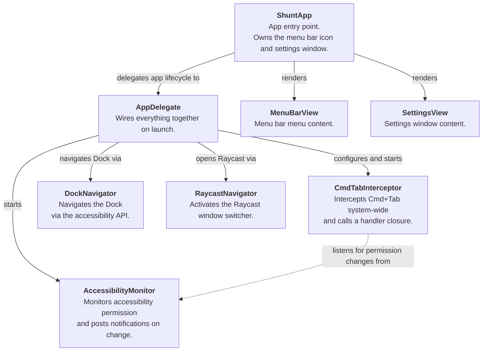

# Architecture

Read each arrow as a sentence: "A [label] B". Solid arrows are direct code
dependencies; the dashed arrow is an indirect `NotificationCenter` relationship.

```mermaid
graph TD
    ShuntApp["<b>ShuntApp</b><br/>App entry point.<br/>Owns the menu bar icon and settings window."]
    AppDelegate["<b>AppDelegate</b><br/>Wires everything together on launch."]
    MenuBarView["<b>MenuBarView</b><br/>Menu bar menu content."]
    SettingsView["<b>SettingsView</b><br/>Settings window content."]
    AccessibilityMonitor["<b>AccessibilityMonitor</b><br/>Monitors accessibility permission<br/>and posts notifications on change."]
    CmdTabInterceptor["<b>CmdTabInterceptor</b><br/>Intercepts Cmd+Tab system-wide<br/>and calls a handler closure."]
    DockNavigator["<b>DockNavigator</b><br/>Navigates the Dock<br/>via the accessibility API."]
    RaycastNavigator["<b>RaycastNavigator</b><br/>Activates the Raycast window switcher."]

    ShuntApp -->|"delegates app lifecycle to"| AppDelegate
    ShuntApp -->|"renders"| MenuBarView
    ShuntApp -->|"renders"| SettingsView

    AppDelegate -->|"starts"| AccessibilityMonitor
    AppDelegate -->|"configures and starts"| CmdTabInterceptor
    AppDelegate -->|"navigates Dock via"| DockNavigator
    AppDelegate -->|"opens Raycast via"| RaycastNavigator

    CmdTabInterceptor -.->|"listens for permission changes from"| AccessibilityMonitor
```
