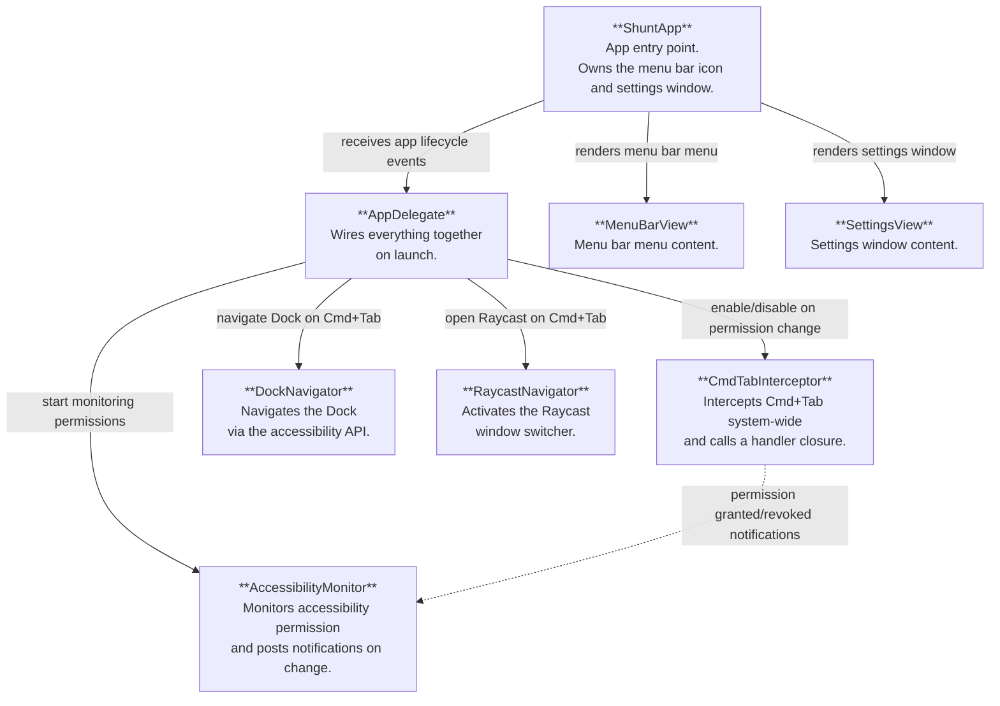

# Architecture

## Dependencies

```mermaid
graph TD
    ShuntApp["**ShuntApp**<br/>App entry point.<br/>Owns the menu bar icon and settings window."]
    AppDelegate["**AppDelegate**<br/>Wires everything together<br/>on launch."]
    MenuBarView["**MenuBarView**<br/>Menu bar menu content."]
    SettingsView["**SettingsView**<br/>Settings window content."]
    AccessibilityMonitor["**AccessibilityMonitor**<br/>Monitors accessibility permission<br/>and posts notifications on change."]
    CmdTabInterceptor["**CmdTabInterceptor**<br/>Intercepts Cmd+Tab system-wide<br/>and calls a handler closure."]
    DockNavigator["**DockNavigator**<br/>Navigates the Dock<br/>via the accessibility API."]
    RaycastNavigator["**RaycastNavigator**<br/>Activates the Raycast<br/>window switcher."]

    ShuntApp -->|"receives app lifecycle events"| AppDelegate
    ShuntApp -->|"renders menu bar menu"| MenuBarView
    ShuntApp -->|"renders settings window"| SettingsView

    AppDelegate -->|"enable/disable on permission change"| CmdTabInterceptor
    AppDelegate -->|"start monitoring permissions"| AccessibilityMonitor
    AppDelegate -->|"navigate Dock on Cmd+Tab"| DockNavigator
    AppDelegate -->|"open Raycast on Cmd+Tab"| RaycastNavigator

    CmdTabInterceptor -.->|"permission granted/revoked notifications"| AccessibilityMonitor
```
