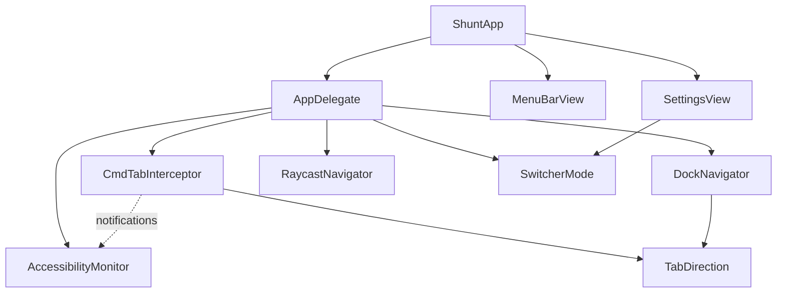

# Architecture

## Dependencies

Solid arrows are direct code dependencies. The dashed arrow is an indirect
`NotificationCenter` relationship — `AccessibilityMonitor` posts notifications
that `CmdTabInterceptor` listens for.

## Responsibilities

| File | Responsibility |
|------|---------------|
| `ShuntApp` | App entry point. Owns the menu bar icon and settings window. |
| `AppDelegate` | Starts the accessibility monitor and Cmd+Tab interceptor on launch. Wires them together. |
| `MenuBarView` | Menu bar menu content. |
| `SettingsView` | Settings window content. Owns the switcher mode and open-at-login preferences. |
| `AccessibilityMonitor` | Monitors accessibility permission status and posts notifications when it changes. |
| `CmdTabInterceptor` | Intercepts Cmd+Tab system-wide and calls a handler closure. Knows nothing about what to do with the keypress. |
| `DockNavigator` | Navigates the Dock via the accessibility API. |
| `RaycastNavigator` | Activates the Raycast window switcher via its deep link URL. |
| `SwitcherMode` | Enum of the available switching strategies. |
| `TabDirection` | Enum for the direction of a Cmd+Tab or Cmd+Shift+Tab keypress. |
